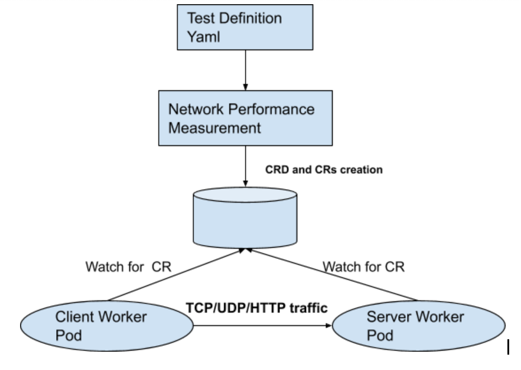

# Enhancing Network Performance Benchmarking Testcases

- [Summary](#summary)
- [Motivation](#motivation)
  - [Goals](#goals)
- [Proposal](#proposal)
  - [Test Scenarios](#test-scenarios)
  - [Tools](#tools)
  - [Resource Requirements](#resource-requirements)  
  - [Future Enhancements](#future-enhancements)  
  - [Benefits](#benefits)
- [Design Details](#design-details)
  - [NetworkPerformanceMetric measurement](#networkperformancemetric-measurement)
  - [Metrics visualization](#metrics-visualization)

## Summary

We are proposing to add more testcases for network performance benchmarking.

## Motivation

As Kubernetes is increasingly being adopted by various telco cloud providers for deployments, 
it brings additional networking requirements/scenarios to be supported.  
With wide array of network functions being containerized, the need to analyse and 
monitor the networking performance metrics such as latency, throughput etc has arisen.

We have evaluated testcases in following 3 frameworks which have limited testcases for network performance benchmarking.

* [E2E](https://github.com/kubernetes/community/blob/master/contributors/devel/sig-testing/e2e-tests.md): This framework has only 2 testcases for measuring throughput.

* [netperf](https://github.com/kubernetes/perf-tests/tree/master/network/benchmarks/netperf) : This framework 
   measures only the throughput between client-server pods for various MSS(Maximum Segment size). 
   Other performance metrics such as latency , loss-rate , response time are not measured.
   
* [clusterloader2](https://github.com/kubernetes/perf-tests/tree/master/clusterloader2) : This framework 
   measures only network latency. Other performance metrics are not measured.

### Goals

The primary goal of this proposal is to enhance the testcases to cover various 
networking scenarios :

1. IPv4 , IPv6 , Dual-Stack.
2. Protocols: TCP, UDP, HTTP/HTTPS.
3. Pod-to-Pod , with services ClusterIP , NodePort etc.

We intend to submit tests to measure the following network performance metrics for various 
scenarios such as different services (ClusterIP/NodePort), with IPv4/IPv6 configured etc.

1. Throughput (For TCP traffic)
2. Packets per second (For UDP traffic)
3. Loss rate (For UDP traffic)
4. Latency/Jitter (For UDP/HTTP/HTTPS)
    (Note: Latency being measured is a one-way latency)
5. Response time (For HTTP/HTTPs)
    (Note: Response time is a two-way latency plus processing time)

Our important goal is to make sure these benchmarking testcases are run periodically,
so that any degradation in performance is detected in early phase of feature delivery.

## Proposal

### Test Scenarios

1. Baseline Testcases

	Following testcases will be able to gather the baseline values for network performance metrics. 

	1.1 Point-To-Point (P2P)

	  

	  1.1.1 Client-Server POD on different worker node (1:1)

	  Testcase-Id | Testcase Description | Tool | Metrics Measured
	  ----------- | ---------------------|------|-----------------
	  TC1.1.1.1   | Send TCP traffic from client pod IP to server pod IP | iperf3 | Throughput in Gbits/s
	  TC1.1.1.2   | Send UDP traffic from client pod IP to server pod IP | iperf2 | Packets per second (pps), Loss Rate, Latency, jitter
	  TC1.1.1.3   | Send HTTP traffic from client pod IP to server pod IP | siege | Latency , ResponseTime

	1.2 ClusterIP / NodePort Services

	  

	  1.2.1 Client-Server POD on different worker node (1:1)

	  TestcaseId | Testcase Description | Tool | Metrics Measured
	  ----------- | ---------------------|------|-----------------
	  TC1.2.1.1   | Send TCP traffic from client pod IP to ClusterIP. 1 server pod is located behind ClusterIP service. | iperf3 | Throughput in Gbits/s
	  TC1.2.1.2   | Send UDP traffic from client pod IP to ClusterIP. 1 server pod is located behind ClusterIP service. | iperf2 | Packets per second (pps), Loss Rate, Latency, jitter
	  TC1.2.1.3   | Send HTTP traffic from client pod IP to ClusterIP. 1 server pod is located behind ClusterIP service. | siege | Latency , ResponseTime
	  TC1.2.1.4   | Send TCP traffic from client pod IP to NodePort svc IP. 1 server pod is located behind NodePort service. | iperf3 | Throughput in Gbits/s
	  TC1.2.1.5   | Send UDP traffic from client pod IP to NodePort svc IP. 1 server pod is located behind NodePort service. | iperf2 | Packets per second (pps), Loss Rate, Latency, jitter
	  TC1.2.1.6   | Send HTTP traffic from client pod IP to NodePort svcIP. 1 server pod is located behind NodePort service. | siege | Latency , ResponseTime

2. Scale Testcases

    2.1 Point-To-Point (P2P) 

    2.1.1 Client-Server POD on different worker node (N:1)

	  TestcaseId  | Testcase Description | Tool | Metrics Measured
	  ----------- | ---------------------|------|-----------------
	  TC2.1.1.1   | Send TCP traffic from N=50 client pods to 1 server pod IP. | iperf3 | Throughput in Gbits/s
	  TC2.1.1.2   | Send TCP traffic from N=100 client pods to 1 server pod IP. | iperf3 | Throughput in Gbits/s
	  TC2.1.1.3   | Send UDP traffic from N=50 client pods to 1 server pod IP. | iperf2 | Packets per second (pps), Loss Rate, Latency, jitter
	  TC2.1.1.4   | Send UDP traffic from N=100 client pods to 1 server pod IP. | iperf2 | Packets per second (pps), Loss Rate, Latency, jitter
	  TC2.1.1.5   | Send HTTP traffic from N=50 client pods to 1 server pod IP. | siege | Latency , ResponseTime
	  TC2.1.1.6   | Send HTTP traffic from N=100 client pods to 1 server pod IP. | siege | Latency , ResponseTime

	2.1.2 Client-Server POD on different worker node (N:M)

	* A pair of client and server pod will be selected out of N/M pod.
	* Client POD size N=50 and Server POD size M=50.
	* This test will require 100 worker nodes i.e N+M, so that we can make sure client and server pods are not co-located.
	* Each metric will be a percentile of 50 pairs.
	

   TestcaseId  | Testcase Description | Tool | Metrics Measured
   ----------- | ---------------------|------|-----------------
    TC2.1.2.1 | Send TCP traffic from client pod IP to server pod IP (1:1) | iperf3 | Throughput in Gbits/s
    TC2.1.2.2 | Send UDP traffic from client pod IP to server pod IP (1:1) | iperf2 | Packets per second (pps), Loss Rate, Latency, jitter
    TC2.1.2.3 | Send HTTP traffic from client pod IP to server pod IP (1:1) | siege | Latency , ResponseTime

    2.2 ClusterIP / NodePort Services

      N:1 Scenario has been intentionally omitted because, in real-world deployment scenarios application 
	  pods will be more than one behind services such as ClusterIP/NodePort.
      
	  2.2.1 Client-Server POD on different worker node (N:M) (HTTP traffic)

	* Client POD size N=50 and Server POD size M=50. 5 HTTP Server PODs will be grouped under 1 Service.
	* 5 Client PODS will send traffic to 1 ClusterIP/NodePort svc IP.
	* Below testcases will measure the network performance metrics with scaled service IPs (1 ClientPOD -> 1 ServiceIP -> 1 ServerPOD), as well as with load-balancing (N ClientPOD -> 1 ServiceIP -> N ServerPOD).
	
     TestcaseId  | Testcase Description | Tool | Metrics Measured
     ----------- | ---------------------|------|-----------------
     TC2.2.1.1  | Send HTTP traffic from 1 client pod IPs to ClusterIP. 1 server pod is located behind ClusterIP service (1:1) | siege | Latency , ResponseTime
     TC2.2.1.2  | Send HTTP traffic from 1 client pod IPs to NodePort svc IP. 1 server pod is located behind NodePort service (1:1) | siege | Latency , ResponseTime
     TC2.2.1.3  | Send HTTP traffic from 5 client pod IPs to ClusterIP. 5 server pods are located behind ClusterIP service. | siege | Latency , ResponseTime
     TC2.2.1.4  | Send HTTP traffic from 5 client pod IPs to NodePort svc IP. 5 server pods are located behind NodePort service. | siege | Latency , ResponseTime
	
      2.2.2 Client-Server POD on different worker node (N:M) (TCP/UDP traffic)
	  
	* Client POD size N=50 and Server POD size M=50. Each server pod will be behind one unique ClusterIP/NodePort Svc. So 50 clusterIP will be created for TCP/UDP traffic only. ( 1 Client POD ---> 1 ClusterIP ---> 1 Server POD)
	* This test will require 100 worker nodes i.e N+M, so that we can make sure client and server pods are not co-located.
	* Each metric will be a percentile of 50 pairs.
		
     TestcaseId  | Testcase Description | Tool | Metrics Measured
     ----------- | ---------------------|------|-----------------
     TC2.2.2.1  | Send TCP traffic from 1 client pod IPs to 1 server pod is located behind respective unique ClusterIP (1:1) | iperf3 | Throughput in Gbits/s
     TC2.2.2.2  | Send UDP traffic from 1 client pod IPs to 1 server pods is located behind respective unique ClusterIP (1:1) | iperf2 | Packets per second (pps), Loss Rate, Latency, jitter
     TC2.2.2.3  | Send TCP traffic from 1 client pod IPs to NodePort svc IP. 1 server pod is located behind NodePort service (1:1) | iperf3 | Throughput in Gbits/s
     TC2.2.2.4  | Send UDP traffic from 1 client pod IPs to NodePort svc IP. 1 server pod is located behind NodePort service (1:1) | iperf2 | Packets per second (pps), Loss Rate, Latency, jitter
    

### Tools

We intend to use the following tools for testing :

1. iperf3: For TCP throughput measurement.

2. iperf2: For UDP latency, loss rate , pps measurement.

3. Siege: Siege is an open source benchmark utility. 
   It will be used for measuring HTTP/HTTPs metrics such as total number of hits recorded, 
   bytes transferred, response time, concurrency, and return status. 

Other tools such as Trex will be used in future for further enhancements.

### Resource Requirements

1. Worker nodes : We will need worker nodes (VMs) to run client and server pods.
   As mentioned in test scenarios, we require 100 worker nodes to run the testcases.

2. Memory : Each worker node should have atleast 4 Gb of memory. 

3. vCPUs : Each worker node should have atleast 2 vCPUs to run tools at full capacity.
   We can pin the vCPUs to tools to run them efficienlty. If multiple client-server pods 
   are run on same worker node, then more then 2 vCPUs might be required.

### Future Enhancements

Performance benchmarking frameworks can be enhanced to include testcases related to various CNIs.

### Benefits

1) Our proposal attempts to standardize the test scenarios and cover most common performance metrics.
2) Detecting performance degradation in early phase of feature delivery.
3) With standard test scenarios available, kubernetes users will be able adopt these test frameworks
   to validate their downstream offerings.  
   
## Design Details

Kubernetes uses the Prow framework for CI/CD and the new network performance related tests are also 
planned to be added as part of prow jobs.

There were multiple test frameworks analysed for running the test cases like: k8s E2E tests 
and sig-scalability’s Netperf and ClusterLoader2 frameworks. Since we are planning to have 
the test cases under sig scalability where ClusterLoader2 is already running many test cases 
as part of kubernetes CI/CD and since the framework is easy to extend for creating new tests 
and test scenarios ,it is decided to use ClusterLoader2 for the implementation. These tests 
needs a statistical distribution on a large number of pods to smooth out infrastructure dependencies 
and cluster loader framework already run tests with similar requirements.

The below 3PP tools will be used for benchmarking network performance:
* Iperf2
* Iperf3
* Siege

These tools would be included as part of a container image and would be run as pods(as client pods 
and server pods) for collecting measurements.

This proposal would be implemented using the measurement mechanism of the clusterloader framework.

### NetworkPerformanceMetric measurement

Following design changes are being made for the test case implementation:

* New measurement is being created for measuring network performance metrics.
  As part of start action of measurement, new CustomResourceDefinition(CRD) is applied on k8s cluster.
  Based on the pod ratio specified(1:1 , N:M) in test yaml, so many worker pods are created.
  Unique client-server worker pods are chosen and a corresponding CR object is created.
  CR object contains attributes (protocol,duration,IPs) to execute the testcase.
  
  Measurement watches for the updates of CR objects by the worker pods. Worker pods update the CR objects
  with the status of testcase execution(either success or failure).
  
  As part of gather action of measurement, metric values are aggregated and result summary is created.
      
* Worker pods watch for respective CR object creation by the measurement.
  When CR is created, client worker pod starts sending traffic to respective server worker pod.
  Based on the attributes in the CR (protocol,duration), specific performance metric measurements are 
  collected and updated back in the CR object.
    

### Metrics visualization

The metrics collected would be displayed in the Perfdash dashboard by modifying the perfdash config.go to 
include all the new metrics collected as part of the new test cases. Perfdash shows graphs containing data 
points from multiple builds(along with historical data) ,this would help in analyzing variation of metrics 
across builds and help identify issues wrt network performance in new builds. The metrics to be displayed 
will be put into a file in the required file format and file name format in the artifacts directory so that 
Perfdash picks up the metrics and displays in its dashboard.

